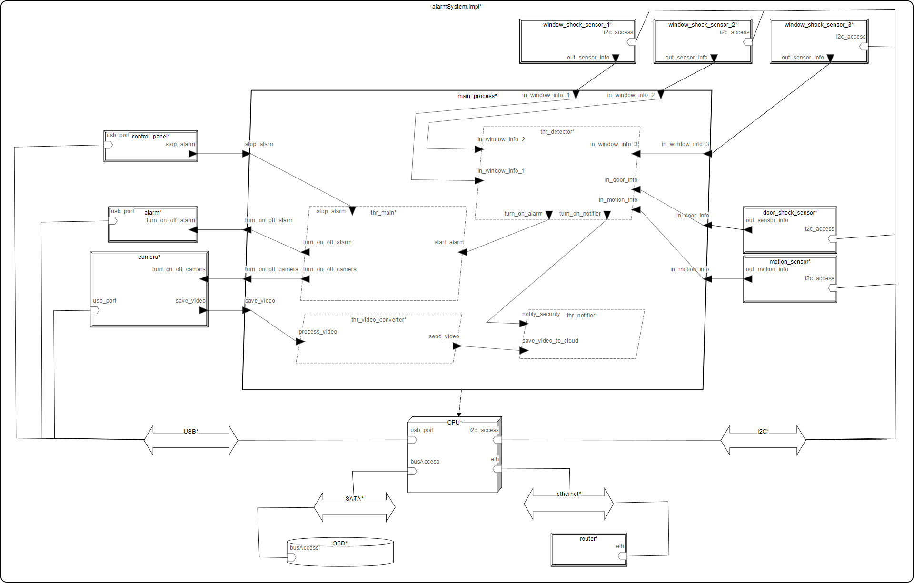

# alarmSystemModel

The Project is about alarm system which consits of sensors mounted on the door and windows. The alarm and camera are activated when undesirable event is detected. Additionaly the system sends messge to security company. The video from camera is processed, stored in the local memory and sent to memory in cloud in order to protect the recording in case of damage to local memory resources. The user can turn off the alarm using the control panel by passing the appropriate PIN code.

|                                    |
| -----------------------------------|
|  |
